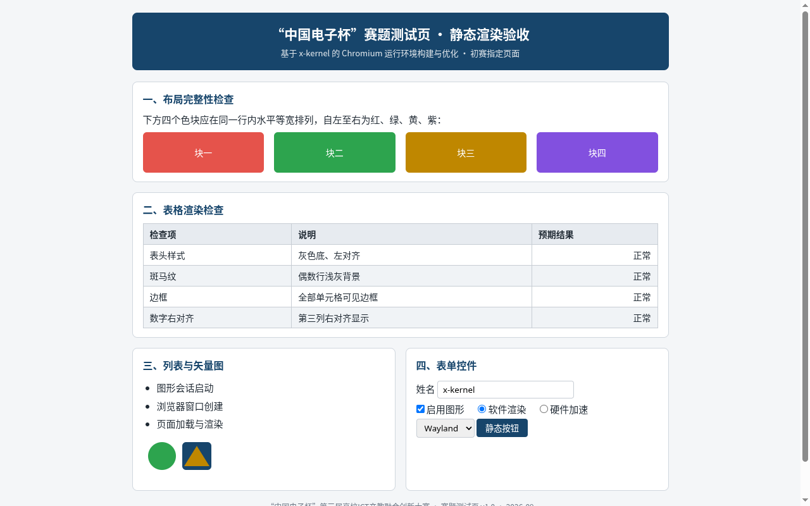
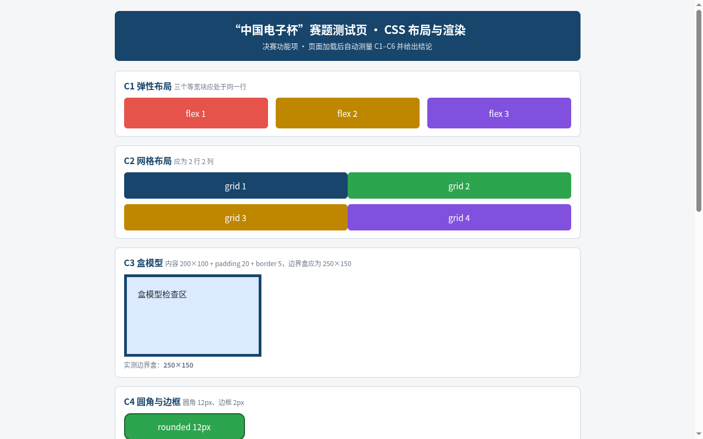
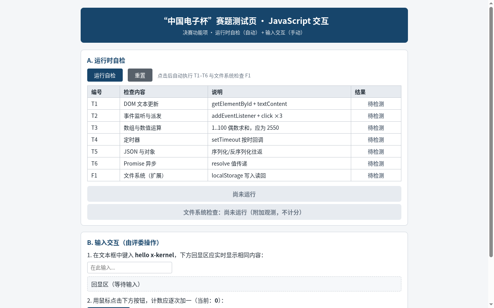

# 阶段四闭环：官方三页 HTML 在 x-kernel 图形链路中渲染

日期：2026-09-23（T490 本地时间 Asia/Shanghai）

## 结论

官方 `index.html`、`layout.html`、`interaction.html` 均已由 guest Alpine Chromium 142 在 T490 上运行的 AArch64 QEMU TCG 中显示；三轮均使用真实 x-kernel DRM/evdev、eudev、libseat/seatd、Weston Pixman 与 Wayland，未设置 `LD_PRELOAD`，未生成伪 sysfs 或伪输入数据库。三个页面文件保持原样，按字节注入并记录了 SHA-256。

Chromium 的多进程启动路径没有建立可见 renderer。页面像素最终通过 Chromium `--single-process --no-zygote` 诊断模式取得；这个运行模式需要在后续工作中换回多进程模式才能满足计划中的最终运行模型。当前用户请求的“三页实际渲染”已完成。

## 关键修复：musl PI futex 探测的 errno

p32/p33 Chromium 日志把启动中止定位到 PulseAudio 的 `pa_mutex_new()`：当 `pthread_mutexattr_setprotocol(PTHREAD_PRIO_INHERIT)` 返回 `ENOSYS`（38）时，PulseAudio 断言失败；它只把 `ENOTSUP`（95）识别为优先级继承不可用并回退普通 mutex。PulseAudio 源码和 POSIX 规范都对应这个回退约定。[PulseAudio mutex 初始化](https://raw.githubusercontent.com/pulseaudio/pulseaudio/master/src/pulsecore/mutex-posix.c)；[POSIX pthread_mutexattr_setprotocol](https://pubs.opengroup.org/onlinepubs/7908799/xsh/pthread_mutexattr_setprotocol.html)

内核 futex 分派原先将所有未知操作映射成 `ENOSYS`。现在对已知但未实现的 PI futex 命令返回 `EOPNOTSUPP`，不谎报 PI 支持；改动保存在 [0011 futex errno patch](patches/0011-futex-pi-unsupported-errno.patch)。musl 1.2.5 运行探针结果为：`protocol_rc=95 enotsup=95 mutex_init=0 lock=0 unlock=0`。修复后的 Chromium 日志不再出现 PulseAudio mutex 断言。

为 Chromium 142 添加了与 guest 版本匹配的 Alpine v3.22 aarch64 `chromium-swiftshader` 官方 CPU Vulkan 运行时；包版本为 `142.0.7444.59-r0`，库和 ICD JSON 来自该包。[Alpine 包元数据](https://pkgs.alpinelinux.org/package/v3.22/community/aarch64/chromium-swiftshader)；[对应版本 APK](https://dl-cdn.alpinelinux.org/alpine/v3.22/community/aarch64/chromium-swiftshader-142.0.7444.59-r0.apk)

## 平台、构建与复现实验

宿主为 T490（Ubuntu 26.04 LTS，x86_64），QEMU 10.2.1；guest 为 AArch64，`-accel` 未启用，2 GiB、4 vCPU，并保留 virtio-gpu、virtio-keyboard、virtio-mouse、virtio-blk、virtio-net。三轮平台检查均为 PASS；完整字面 QEMU 命令、环境和时间戳保存在各轮 `cmd.txt`、`env.txt`、`manifest.txt` 中。

PI errno 修复后的内核以以下命令构建：

```bash
cd /home/mo/x-kernel
export PATH=/home/mo/.cargo/bin:/home/mo/qemu-root/usr/bin:/home/mo/musl/aarch64-linux-musl-cross/bin:/usr/local/bin:/usr/bin:/bin
make RUSTFLAGS="-Zcrate-attr=feature(cfg_select)" build
```

三次页面会话都使用 `agentos-weston.img` 与 `eudev-seatprobe-libinput-swiftshader-p31.tar.gz`；主命令如下：

```bash
cd /home/mo/xk6
BASE_IMG=/home/mo/x-kernel/images/agentos-weston.img \
PKG_TARBALL=/home/mo/xk6/tmp/eudev-seatprobe-libinput-swiftshader-p31.tar.gz \
GL_VARIANT=angle-swiftshader GPU_MODEL=in-process \
bash scripts/t490/t490_round.sh input-seat36-singleprocess-pi-fixed 540 45 \
  autorun_input36.sh evprobe.c inputudevprobe.c seqpacketprobe.c ueventprobe2.c \
  udevinitprobe.c statprobe.c passcredprobe.c p33_pi_mutex.c

PAGE_URL=file:///usr/share/html-test/layout.html \
BASE_IMG=/home/mo/x-kernel/images/agentos-weston.img \
PKG_TARBALL=/home/mo/xk6/tmp/eudev-seatprobe-libinput-swiftshader-p31.tar.gz \
GL_VARIANT=angle-swiftshader GPU_MODEL=in-process \
bash scripts/t490/t490_round.sh input-seat37-layout-render 420 45 \
  autorun_input37.sh evprobe.c inputudevprobe.c seqpacketprobe.c ueventprobe2.c \
  udevinitprobe.c statprobe.c passcredprobe.c p33_pi_mutex.c

PAGE_URL=file:///usr/share/html-test/interaction.html \
BASE_IMG=/home/mo/x-kernel/images/agentos-weston.img \
PKG_TARBALL=/home/mo/xk6/tmp/eudev-seatprobe-libinput-swiftshader-p31.tar.gz \
GL_VARIANT=angle-swiftshader GPU_MODEL=in-process \
bash scripts/t490/t490_round.sh input-seat38-interaction-render 420 45 \
  autorun_input38.sh evprobe.c inputudevprobe.c seqpacketprobe.c ueventprobe2.c \
  udevinitprobe.c statprobe.c passcredprobe.c p33_pi_mutex.c
```

The entry page is baked into the autorun copy by `t490_round.sh`; all three page files are injected and byte-verified before QEMU starts. Each evidence directory holds the precise per-run build manifest and command file.

## 页面结果

| 页面 | 场景 / QEMU 原始 PPM | 像素判据 |
|---|---|---|
| 首页 | [p36 shot-04-at0180s.ppm](../evidence/2026-09-23_t490-input-seat36-singleprocess-pi-fixed/screenshots/shot-04-at0180s.ppm) | `official-index` 严格集 7/7；四色块顺序、同一行、等宽和表格签名通过（[判据 JSON](rendered-pages/index-assert.json)） |
| 布局页 | [p37 shot-05-at0225s.ppm](../evidence/2026-09-23_t490-input-seat37-layout-render/screenshots/shot-05-at0225s.ppm) | `official-layout` 严格集 5/5；C1 flex、C2 grid、C3 盒模型通过（[判据 JSON](rendered-pages/layout-assert.json)）。C1–C6 结论条位于首屏下方，本轮未滚动补拍 |
| 交互页 | [p38 shot-05-at0225s.ppm](../evidence/2026-09-23_t490-input-seat38-interaction-render/screenshots/shot-05-at0225s.ppm) | `official-interaction` 严格集 4/4；页头、自检表、按钮和输入控件通过（[判据 JSON](rendered-pages/interaction-assert.json)）。页面保持官方初始态，T1–T6/F1 自检尚未点击 |

### 首页



### 布局页



### 交互页



## 可复核指纹

- 页面集：`index.html` `831cf28f3748940b450d1da325aa39a2dcaea2fee15b0532bf4111144d176b38`；`interaction.html` `58130daa4a2f426fd16b8bde93d964713f20e147da8af1537ab2d8b506d2fd58`；`layout.html` `a1b04f9aba81b4b7818be2e7a858d482d471bd0d625dee257f605b2129b8fc4c`。
- P36–P38 共享内核二进制 SHA-256：`869a8fea360968b49f2ff1d25e83fdd3db25fc5eef4694ce5a4c697583fc8822`。
- SwiftShader 原始 APK：`fddbdf48c58ef774bfefa6ad47882a2803cf0046c83375566ad3f746704bb846`；运行库：`e015bef72f2950c15b4861d6c22530269d404d499fa7c4611cf4c27d8fed648c`；ICD JSON：`c9eef28b6b984fec220ef0abfecc40b502d46946706e47bfe97707027cb818bd`。
- 核心证据包：`2026-09-23_t490-input-seat36-singleprocess-pi-fixed`、`2026-09-23_t490-input-seat37-layout-render`、`2026-09-23_t490-input-seat38-interaction-render`。

P36–P38 的 QEMU 命令均满足平台检查：AArch64，2 GiB，4 vCPU，纯 TCG，无 `-accel`；保留 virtio-gpu、virtio-keyboard、virtio-mouse、virtio-blk、virtio-net。Weston 日志确认 `Output 'Virtual-1' enabled`，真实 eudev/libinput 识别键盘与鼠标；p35 的 `weston-simple-shm` 原始截图额外证明普通 Wayland SHM 客户端确实被合成到输出。

## 后续未覆盖的验收项

此处停止在三页渲染里程碑。正式的多进程 renderer 启动、布局页首屏外结论条、交互页真实点击与键入、T1–T6/F1、10 分钟稳定运行以及第二次独立冷启动仍需要单独完成。当前没有把页面“看见”推断成这些功能项通过。
