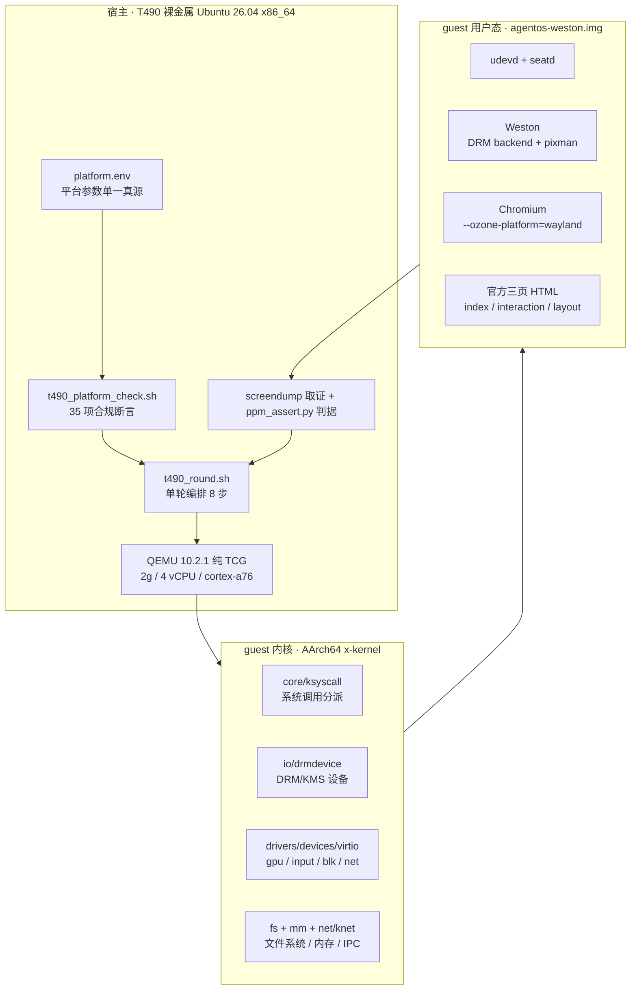
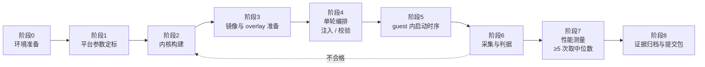
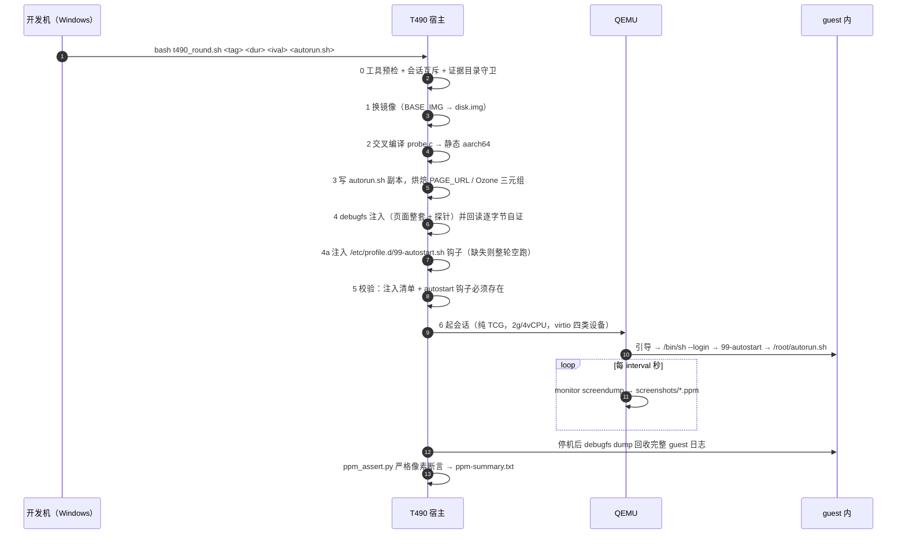
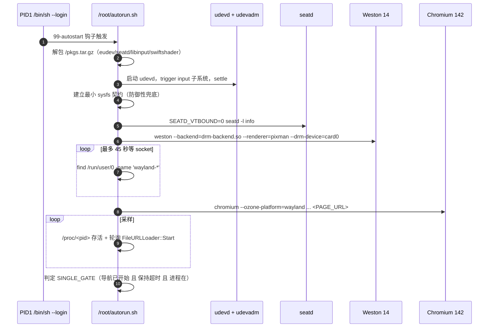
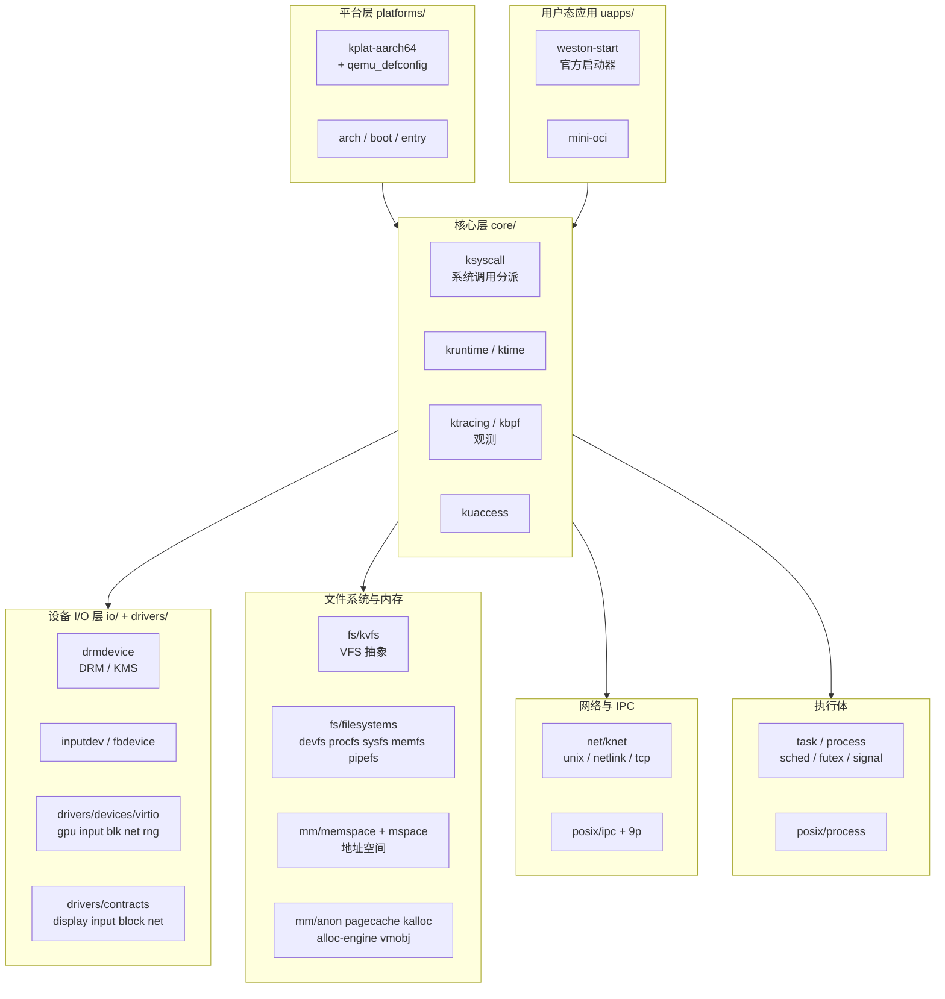
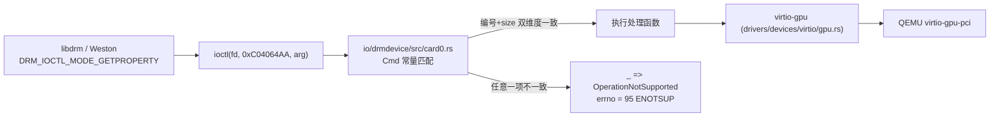
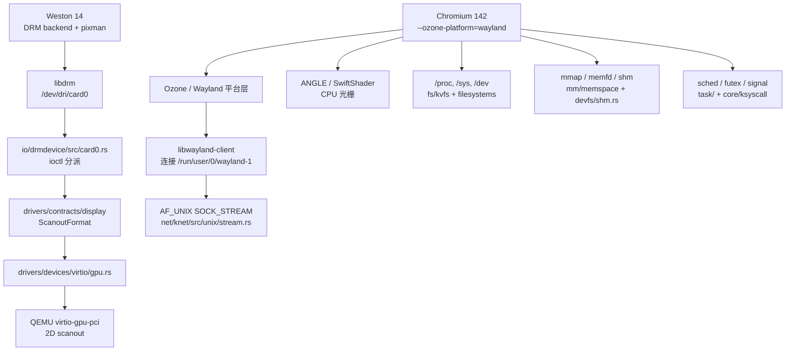
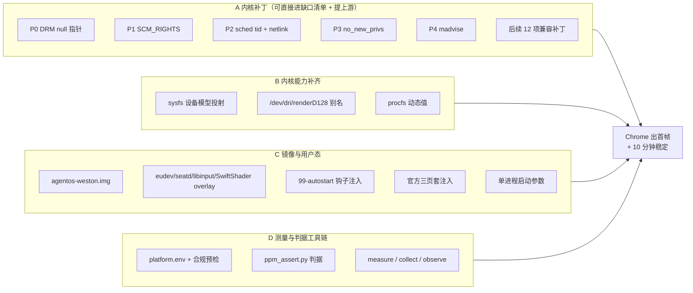
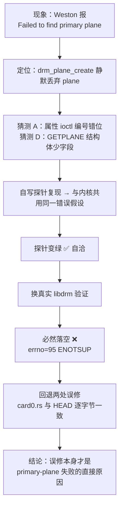

# 48 · 赛题六项目完整实现讲解：从启动到 Chrome 运行

> 面向对象：第一次接触本项目、需要快速上手实践的初学者。
> 阅读方式：先读第 0 章（拆题）建立坐标系，再按第 1→2→3 章顺序读。
> 第 1 章讲"怎么跑起来"，第 2 章讲"内核必须提供什么"，第 3 章讲"我们额外补了什么、为什么必须补"。
>
> 全文结论均可追溯到 `report/` 下的编号报告与本目录的脚本/证据；本文只做**归纳讲解**，
> 不替代原始证据。凡是尚未闭环的判断，本文一律显式标注，不写成"已证"。

---

## 0. 先把题拆开：这个项目到底在做什么

### 0.1 一句话题目

> 在组委会指定的 **AArch64 QEMU 虚拟平台**上，用指定的 Rust 内核 **x-kernel**，
> 把**图形界面（Weston / Wayland）**和**浏览器（Chromium）**跑起来，
> 正确渲染组委会指定的 HTML 页面，稳定运行不少于 10 分钟，
> 并提交**内核兼容性缺口、修复补丁、可复现的测量方法与原始数据**。

注意这是一道"**移植 + 兼容性**"题，不是"写业务代码"题。你面对的不是一个空白项目，
而是一个**已经能启动、但用户态大型软件跑不动**的内核 —— 你的工作是**找出并补齐它缺的能力**。

### 0.2 三层结构

```
┌─────────────────────────────────────────────────────────┐
│ 用户态（40 分）   Weston 合成器 + Chromium 浏览器          │
├─────────────────────────────────────────────────────────┤
│ 内核态（25 分）   x-kernel：syscall / DRM / VFS / 内存 / 网络 │  ← 分值最高，只能自己啃
├─────────────────────────────────────────────────────────┤
│ 平台层（合规红线） AArch64 + QEMU 纯 TCG + 四类 virtio 设备  │  ← 不合规则数据作废
└─────────────────────────────────────────────────────────┘
```

### 0.3 评分表决定投入方向（初赛满分 100）

| 评分项 | 分值 | 落在哪一层 |
|---|---:|---|
| **系统兼容性与移植分析** | **25** | **内核态**（8 缺口 ×1 + 上游 patch ×4/个（≤3）+ Linux 基线对比 5） |
| 图形环境启动与稳定性 | 20 | 用户态，**前置是内核图形能力配置** |
| 浏览器基础功能 | 20 | 用户态（Chromium） |
| 性能观测与量化方法 | 15 | 跨层（度量） |
| 技术文档与代码规范 | 10 | 文档 |
| 演示效果 | 10 | 演示 |

**关键认知（一定要先建立）**：

1. 不是"只能做内核态"，而是**内核能力是用户态图形分项的前置条件**——图形起不来，40 分归零，
   而图形起不来的原因有极大概率在内核里。
2. 内核态是**分值最高、且无法用用户态技巧绕开**的单项，也是决赛"开源回馈（9 分）"的唯一来源。
3. 因此排查顺序必须是：**先读内核能力表（ioctl/syscall 分派表）→ 再决定用户态怎么用**。
   反过来"在用户态堆启动脚本、用排除法倒推内核"会浪费整轮整轮的时间（这是本项目真实踩过的坑）。

### 0.4 全局总览



---

## 1. 项目从启动到运行的完整流程

整条链路可以拆成 **8 个阶段**。记住一个心法：**每一阶段都有"产出物"，下一阶段只消费上一阶段的产出**；
任何一环断了，都会在后面以"现象"的形式暴露，而定位时应当**回到产物那一环去查**。

### 1.1 端到端流程



### 1.2 逐阶段拆解

| 阶段 | 做什么 | 关键脚本 / 文件 | 产出物 |
|---|---|---|---|
| **0 环境准备** | 在 T490 上装齐 QEMU 10.2.1（`apt-get download` + `dpkg -x` 绕 sudo）、Rust 1.95 与双 target、musl 交叉工具链、`rust-objcopy` | `probe_t490.sh`、`prepare_t490.sh`、`push_musl_from_wsl.sh`、`t490_fix_objcopy.sh` | 可用的交叉编译工具链 |
| **1 平台参数定标** | 把赛题第七节(一)的所有取值收敛到**单一真源**，并做机器可校验断言 | `platform.env`、`t490_platform_check.sh` | `platform-check.txt`（35 项 PASS/FAIL） |
| **2 内核构建** | defconfig → **架构断言** → rootfs 扩容 → uapps → `make build` | `build_xk_t490.sh`、`make build` | `kernel.bin`（含 SHA-256 指纹） |
| **3 镜像与 overlay** | 准备基础镜像 + 运行时补包（eudev / seatd / libinput / SwiftShader） | `agentos-weston.img`、`t490_build_pkgs.sh` | `agentos-weston.img` + `pkgs.tar.gz` |
| **4 单轮编排** | 换镜像 → 编译探针 → 注入 autorun / 页面 / autostart 钩子 → 回读自证 | `t490_round.sh` | 注好内容的 `disk.img` + `manifest.txt` |
| **5 guest 启动时序** | udevd → seatd → Weston → Wayland socket → Chromium → 加载页面 | `guest-autostart.sh`、`autorun_single_initial.sh` | `console.log`、`single-initial.log` |
| **6 采集与判据** | QEMU monitor `screendump` 出 PPM → 与参考图做严格像素断言 | `run-session.py`、`ppm_assert.py` | `screenshots/*.ppm`、`ppm-summary.txt` |
| **7 性能测量** | 同配置重复 ≥5 次，取中位数 + 极差 + 宿主指纹 | `measure-single-initial.sh`、`collect_single_metrics.py`、`observe_qemu.py` | `raw.csv`、`summary.json` |
| **8 归档提交** | 组装不可覆盖的证据包与索引 | `report/42`、`report/45` | 提交包 |

### 1.3 关键设计一：为什么要有 `platform.env`

这是本项目最值得学的一处工程实践。早期 QEMU 参数散落在 4 个脚本和文档里，
"改一处忘一处"就会与赛题要求漂移。现在全部收敛：

```sh
# scripts/t490/platform.env（节选，语义注释保留）
PLAT_ARCH="aarch64"
PLAT_DEFCONFIG="platforms/kplat-aarch64/qemu_defconfig"   # ★ 不是上游 README 那个 404 路径
PLAT_QEMU_MIN_MAJOR="8"                                   # 赛题：QEMU ≥ 8.0
PLAT_ACCEL="n"                                            # n => 命令行不出现 -accel（纯 TCG）
PLAT_CPU_TCG="cortex-a76"                                 # 出现它就是纯 TCG 的证据
PLAT_GRAPHIC="y"                                          # 追加 virtio-gpu-pci -vga none -serial mon:stdio
PLAT_MEM="2g"
PLAT_SMP="4"
PLAT_MAKE_ARGS="GRAPHIC=$PLAT_GRAPHIC ACCEL=$PLAT_ACCEL MEM=$PLAT_MEM SMP=$PLAT_SMP VSOCK=$PLAT_VSOCK"
```

**要点**：`-cpu cortex-a76` 本身就是纯 TCG 的判据 —— xkmake 只在 `accel.is_some()` 时才填 `host`。
所以判据是"命令行**没有** `-accel`"，而不是"命令行**有** `--no-accel`"。

### 1.4 关键设计二：单轮编排的 8 步

`t490_round.sh` 是宿主侧的"单轮引擎"，它把"改一点东西测一轮"的重复劳动固化成流水线：



**为什么需要第 4a 步（血泪点）**：agentos 官方 kiosk 镜像的 `/etc/profile.d/` 里
**没有** `99-autostart.sh`，因此 `/root/autorun.sh` 永远不会被拉起 —— 整轮会"静默空跑"，
证据看起来正常但什么都没测。所以钩子必须**随轮注入并回读自证**。
**换新镜像第一件事就是确认这个钩子。**

### 1.5 关键设计三：guest 内的启动时序



**这里有个容易误判的坑**：判据不能用 `pgrep`。
不能只看"socket 存在"就认为 Weston 可用 —— Weston 会**先建 socket，约 7 秒后 DDX/backend 失败才清理**，
中间存在十几秒的"假可用窗口"。必须用**功能门禁**（例如 `xset q`、或直接看 renderer 是否出图）。
同理，Xorg 场景下 `pgrep -x Xorg` 在该 guest 恒为空，要用 `/proc/<pid>` 判断。

### 1.6 判据是怎么来的（不是"看着像就行"）

功能证据**只认 QEMU monitor 的 `screendump`**。流程是：

```
monitor screendump  →  screenshots/*.ppm  →  ppm_assert.py  →  ppm-summary.txt / ppm-assert-*.json
```

`ppm_assert.py` 的判据常量**来自参考图的实测值**，不是从 CSS 反推的。
参考图放在 `scripts/testpage/reference/ref-official-{index,interaction,layout}-{1280x800,640x480}.png`。

三条必须记住的页面事实（实测）：

1. `index.html` 是**无脚本静态页** → 不能对它做双帧差分（必然 0 差异），JS 存活要看结论条颜色；
2. `interaction.html` 的自检**必须有一次真实点击**（未点击时结论条是灰的，点击后才变绿底）；
3. `layout.html` 的"6/6 通过"结论条在整页 y≈1450 处，1280×800 的首屏 screendump **看不到**。

---

## 2. 支撑 Chrome 启动所必需的内核组件

### 2.1 先问：一个 Chrome 启动，内核得提供什么

不要一上来就看代码。先用大白话列出"一个浏览器从零到画出第一帧，会向内核要哪些东西"：

| # | Chrome 会做的事 | 向内核要的能力 | 缺了会怎样 |
|---|---|---|---|
| 1 | 进程创建、多线程 | `clone/clone3`、`execve`、tid/tgid、`set_tid_address` | 起不来或线程组错乱 |
| 2 | 加载 .so、JIT | `mmap`/`mprotect`/`mremap`、`memfd_create` | 崩在 ELF loader |
| 3 | 进程间传递 fd（Mojo/sandbox） | `sendmsg/recvmsg` + `SCM_RIGHTS`/`SCM_CREDENTIALS`/`MSG_CMSG_CLOEXEC` | 子进程拿不到 fd，renderer 死 |
| 4 | 窗口 + 合成 | Wayland socket（`AF_UNIX` stream）、`wl_shm` 共享内存 | 只有 socket，没有窗口 |
| 5 | 直接访问显示设备 | `/dev/dri/card0` + DRM/KMS ioctl 全套 | Weston 起不来 |
| 6 | 扫描输出 | dumb buffer 创建 / 映射 / 附着 framebuffer / plane 提交 | 黑屏 "Display output is not active" |
| 7 | 设备发现 | `/sys/class/drm`、`/sys/class/input`、udev uevent | 合成器**根本走不到 open()** |
| 8 | 读配置、状态 | `procfs`（`uptime`/`stat`/`loadavg`/`meminfo`/`statm`）、`sysfs` | 启动逻辑读到 0 值，行为异常 |
| 9 | 超时与等待 | `epoll`/`ppoll`/`poll`、`eventfd`/`timerfd`、`futex` | 卡死或忙等 |
| 10 | 沙箱 | `prctl(PR_SET_NO_NEW_PRIVS)`、`PR_SET_PDEATHSIG`、seccomp 前置 | 子进程全灭 |
| 11 | 网络（NetworkService） | `socket`/`connect`/`TCP_KEEPIDLE` 等 sockopt | 报 `ENOPROTOOPT` 但不致命 |

**这张表就是"内核能力清单"的雏形。** 下面把它映射到真实代码。

### 2.2 内核子系统总图



### 2.3 能力 → 代码落点对照表

| 能力 | 子系统 / crate | 关键文件 | 说明 |
|---|---|---|---|
| 平台定标 | `platforms/kplat-aarch64` | `qemu_defconfig` | 明写 `KFEAT_DRIVER_VIRTIO_GPU=y` / `KFEAT_DRIVER_VIRTIO_INPUT=y`，注释原文 "Weston graphics requires the virtio GPU and input drivers." |
| 启动引导 | `boot/` `entry/` `arch/` | — | 引导到 `/bin/sh --login` |
| 系统调用 ABI | `core/ksyscall` | `src/dispatch.rs`（**约 250 个 `Sysno::` 分支**）、`src/sys.rs`、`src/{arch,task,time,vfs,io_mpx,ipc,sync}/` | 内核能力清单的**第一真源** |
| POSIX 语义补全 | `posix/` | `process` `mm` `net` `fs` `ipc` `bpf` | syscall 之上的语义层 |
| 进程与线程 | `task/` `process/` | `core/ksyscall/src/task/{sched,ctl}.rs` | tgid/tid、`prctl`、优先级继承 |
| 内存管理 | `mm/` | `memspace/src/aspace.rs`、`posix/mm/src/mmap.rs`、`anon/`、`pagecache/`、`kalloc/` | `mmap`/`madvise`/写时复制 |
| 虚拟文件系统 | `fs/kvfs` | `mount.rs` `path.rs` `namei.rs` `address_space/` | 挂载、路径解析、页缓存 |
| 具体文件系统 | `fs/filesystems` | `devfs/`（`nodes/dri.rs` `nodes/event.rs` `nodes/fb.rs` `nodes/pts.rs` `nodes/shm.rs`）、`procfs/`、`sysfs/`、`memfs/`、`pipefs/`、`anon_inodefs/` | `/dev/dri/card0`、`/dev/input/eventN`、`/proc/*`、`/sys/*` |
| **DRM / KMS** | `io/drmdevice` | `src/card0.rs`（**1486 行，ioctl 主体**）、`src/consts.rs`（ing号与常量）、`src/drm.rs` | 图形链路的核心 |
| 输入设备 | `io/inputdev` | — | evdev 事件 |
| 帧缓冲 | `io/fbdevice` | — | `/dev/fb0` |
| 虚拟设备驱动 | `drivers/devices/virtio` | `gpu.rs` `input.rs` `blk.rs` `net.rs` `pci.rs` `rng.rs` | QEMU 侧设备对接 |
| 驱动契约 | `drivers/contracts` | `display/src/lib.rs`（`ScanoutFormat`）、`input` `block` `net` `kclass` `kdevice` | 抽象边界，**格式能力在这里定义** |
| 网络 / IPC | `net/knet` | `unix/stream.rs`、`unix/stream/channel.rs`、`netlink/socket.rs` | Wayland socket、Mojo、netlink |
| 观测 | `core/ktracing` `core/kbpf` | — | tracepoint、kBPF（配合 15 分性能项） |
| 官方用户态 | `uapps/weston-start` | `xk-weston-start` | 组委会给的 Weston 启动器 |

### 2.4 重点链路一：DRM / KMS 到底要实现哪些 ioctl

`io/drmdevice/src/consts.rs` 里 `iowr<T>()` **把结构体大小编进 ioctl 号**，与 Linux `_IOWR` 语义一致：

```rust
const fn ioc(dir: u32, ty: u8, nr: u8, size: u16) -> u32 {
    (dir << 30) | ((size as u32) << 16) | ((ty as u32) << 8) | (nr as u32)
}
#[inline]
pub(crate) const fn iowr<T>(ty: u8, nr: u8) -> u32 {
    ioc(IOC_READ | IOC_WRITE, ty, nr, core::mem::size_of::<T>() as u16)
}
```

**这句话是整章的关键**：编号对不上 **或** 结构体大小对不上，都会导致分派失败，
最后落到 `_ => Err(VfsError::OperationNotSupported)`，表现为 `errno=95 (ENOTSUP)`。
所以**任何内核算术改动，都必须用真实 libdrm / 标准头文件验签，禁止用自写探针自证**。

当前 `card0.rs` 已实现的 DRM ioctl（`DRM_TYPE = b'd'`）：

| 编号 | 语义 | 状态 | 备注 |
|---|---|---|---|
| `0x00` | `GET_VERSION` | ✅ | `driver='simpledrm' 1.0.0'` |
| `0x01` / `0x07` | `GET_UNIQUE` / `SET_VERSION` | ✅ | |
| `0x02` / `0x03` | `AUTH` / `DROP_AUTH` | ✅ | |
| `0x0c` | `GET_CAP` | ✅ | `DRM_CAP_DUMB_BUFFER` 等 |
| `0x1e` / `0x1f` | `SET_MASTER` / `DROP_MASTER` | ✅ | |
| `0x2d` / `0x2e` | `PRIME_HANDLE_TO_FD` / `FD_TO_HANDLE` | ✅ | |
| `0x3a` | `WAIT_VBLANK` | ✅ | |
| `0xa0` | `MODE_GETRESOURCES` | ✅ | `fbs=0 crtcs=1 conns=1 encs=1` |
| `0xa1` / `0xa2` | `MODE_GETCRTC` / `SETCRTC` | ✅ | |
| `0xa6` / `0xa7` | `MODE_GETENCODER` / `GETCONNECTOR` | ✅ | `Virtual-1 connected`，1280×800@60 |
| `0xaa` | `MODE_GETPROPERTY` | ✅ | **编号必须与 Linux uapi 一致（`0xAA`）** |
| `0xac` | `MODE_GETPROPBLOB` | ✅ | 同上（`0xAC`） |
| `0xaf` | `MODE_RMFB` | ✅ | |
| `0xb0` | `MODE_PAGE_FLIP` | ✅ | |
| `0xb1` | `MODE_DIRTYFB` | ✅ | |
| `0xb2` / `0xb3` / `0xb4` | `CREATE_DUMB` / `MAP_DUMB` / `DESTROY_DUMB` | ⚠️ | **只接受 bpp==32** |
| `0xb5` / `0xb6` | `GETPLANE_RESOURCES` / `GETPLANE` | ✅ | 结构体必须是标准 32 字节 |
| `0xb8` | `MODE_ADDFB2` | ⚠️ | 仅收 `XRGB8888` / `ARGB8888` |
| `0xb9` | `MODE_OBJ_GETPROPERTIES` | ✅ | |
| `0xbc` | `MODE_ATOMIC` | ✅ | |
| `0xbd` / `0xbe` | `CREATEBLOB` / `DESTROYPROPBLOB` | ✅ | |
| **未实现** | `MODE_GETFB(0xAD)`、`MODE_ADDFB(0xAE)`、`MODE_SETPLANE(0xB7)`、`OBJ_SETPROPERTY(0xBA)`、`CURSOR/CURSOR2(0xA3/0xBB)`、`GET/SETGAMMA(0xA4/0xA5)` | ❌ | 落到 ENOTSUP，已进入缺口清单 |

**iowr 编号必须与入口里的 ioctl 编号一致**：



### 2.5 重点链路二：VFS 决定"设备存在与否"

图形链路能不能走通，**第一关不是 `open()`，而是"设备节点和 sysfs 存不存在"**。
Weston 14 的 DRM backend 会**先用 libudev 去 `/sys/class/drm/<name>` 查设备**：

```c
/* libweston/backend-drm/drm.c（Weston 14.0.2，open_specific_drm_device） */
udev_device = udev_device_new_from_subsystem_sysname(b->udev, "drm", name);
if (!udev_device) {
    weston_log("ERROR: could not open DRM device '%s'\n", name);   /* ← 我们看到的报错 */
    return NULL;
}
```

查不到就**直接返回，根本不走到 `open()` 和 `libseat_open_device()`**。
所以无论怎么调参数、用不用 seatd，都必然失败。

本项目仓库的 `fs/filesystems/sysfs/src/lib.rs` 已经实现了这部分投射：

| 投射出的路径 | 代码位置 |
|---|---|
| `/sys/class/drm/card0`（symlink） | `add_drm_entries()` |
| `/sys/devices/pci0000:00/0000:00:03.0/drm/card0` | 同上 |
| `/sys/dev/char/<maj>:<min>` | `character_device_link` |
| `/sys/class/input/inputN`、`/sys/class/input/eventN` | input 类投射 |
| `/sys/<device>/subsystem`、`/sys/bus/...` | 子系统软链 |

同时 `fs/filesystems/devfs/src/nodes/` 提供 `/dev/dri`、`/dev/fb`、`/dev/input/event*`、`/dev/pts`、`/dev/shm` 等节点。

### 2.6 Chrome → 内核 的完整调用链



---

## 3. 为使 Chrome 正常运行而额外补充的内容

上游内核能启动、能跑 shell，但**跑不动大型用户态图形程序**。
第 2 章是"底座"，本章是"我们在底座上补的砖"。分四类。

### 3.1 总览



### 3.2 A 类：内核补丁（这是 25 分的核心产出）

| 序 | 补丁 | 落点 | 现象 → 修复 | 状态 |
|---|---|---|---|---|
| **P0** | tolerate NULL pointers in `DRM_IOCTL_VERSION` | `io/drmdevice/src/card0.rs` | 传 NULL 参数内核直接崩 → 容忍并返回 | ✅ commit `8162e8a`，补丁 `0001` |
| **P1** | AF_UNIX `SOCK_STREAM` 传递 ancillary data | `net/knet/src/unix/stream.rs`、`unix/stream/channel.rs` | Wayland / Mojo 靠 `SCM_RIGHTS` 传 fd，不实现则 fd 传递失败 | ✅ `0002` |
| **P2-a** | `sched_target` 同时按 **tid** 解析 | `core/ksyscall/src/task/sched.rs` | 子线程 `sched_getparam` 解析错 | ✅ `0003` |
| **P2-b** | netlink `bind` 接受 `groups != 0` | `net/knet/src/netlink/socket.rs` | udev 组订阅失败 | ✅ `0004` |
| **P3** | 实现 `prctl(PR_SET_NO_NEW_PRIVS)` | `core/ksyscall/src/task/ctl.rs` | 原为 ENOSYS → Chromium 子进程全灭 | ✅ `0005` |
| **P4** | `madvise` 白名单 + 允许跨洞 `DONTNEED` | `posix/mm/src/mmap.rs`、`mm/memspace/src/aspace.rs` | 合法 madvise 被拒 | ✅ `0006`（探针 4 项转正，未解决 renderer） |
| 后续 | `SCM_CREDENTIALS` | `net/knet` | 凭据传递 | ✅ `0007` |
| 后续 | procfs inotify / quota 文件 | `procfs` | 缺文件 | ✅ `0010` |
| 后续 | futex PI 未实现返回 `EOPNOTSUPP` | `posix/…` | musl 可回退普通 mutex | ✅ `0011` |
| 后续 | `/proc` 内存统计快照 | `mm` | 内存项可读 | ✅ `0012` |
| 后续 | `MSG_CMSG_CLOEXEC` | `net/knet` | fd 泄漏 | ✅ `0013` |
| 后续 | aarch64 `/proc/cpuinfo` | `procfs` | 字段错 | ✅ `0009` |

> 补丁集见 `report/patches/`（`0001`–`0018`，缺 `0008`；索引与覆盖关系见 `report/patches/README.md`）。
> 其中 **上游 MR !831 已合并**。这是"上游 patch 每个 4 分"的来源。

同时报告 §39 记录了一批**已合入工作树的兼容改动**（可直接写成缺口条目）：

1. fd 表下界复制（避免 zygote 继承 fd 时把低号 fd 覆盖成错误对象）；
2. Unix `SCM_RIGHTS` / `SCM_CREDENTIALS` / `MSG_CMSG_CLOEXEC` 收发与 fd 安装；
3. AArch64 `ppoll_time64` 分派；
4. procfs 任务目录 nlink 与线程数一致；
5. `/dev/dri/renderD128` 兼容别名；
6. `PR_SET_PDEATHSIG` / `PR_GET_PDEATHSIG` 最小 ABI；
7. `/proc/stat`、`/proc/loadavg`、`/proc/meminfo`、`/proc/<pid>/statm` 最小接口；
8. Unix DGRAM/SEQPACKET socketpair 半关闭、凭据传递、`SCM_RIGHTS`；
9. TCP `TCP_KEEPIDLE` / `TCP_KEEPINTVL` / `TCP_KEEPCNT`（消除 `ENOPROTOOPT`）；
10. `/proc/uptime` 从硬编码 `0.00 0.00` 改为内核单调时钟动态值。

### 3.3 B 类：内核能力补齐（不是"补丁"，是"从无到有"）

| 项 | 为什么必须 | 落点 |
|---|---|---|
| **sysfs 设备模型投射** | Weston 14 用 libudev 查 `/sys/class/drm/<name>`，查不到就**根本不 open** | `fs/filesystems/sysfs/src/lib.rs` |
| `/dev/dri/renderD128` 别名 | 部分用户态按 render node 找设备 | `fs/filesystems/devfs/src/nodes/dri.rs` |
| procfs 动态 uptime | 原为常量 0，Chromium 启动计时全错 | `procfs` |
| input 类 sysfs（`inputN`/`eventN`） | libinput / udev 输入设备归类 | `sysfs/src/lib.rs` |

> **注意**：`scripts/t490/autorun_single_initial.sh` 里仍保留了一段"最小 sysfs 契约"的
> 手工写入（`/sys/class/drm/card0/{uevent,dev,subsystem}`）。
> 这在早期是**必需的绕过手段**，现在作为**防御性兜底**保留。
> 需要强调的是：`/sys` 是内存文件系统，运行时写入有效，但**镜像里预置的会被挂载覆盖** ——
> 所以这类内容只能在运行时构造。

### 3.4 C 类：镜像与用户态

| 项 | 内容 | 为什么必须 |
|---|---|---|
| **基础镜像** | `agentos-weston.img`（Alpine 3.22 + Weston 全家桶） | 上游测试用的 X11 kiosk 镜像**没有 weston / seatd / Xwayland**，而官方意图路线是 Weston + Wayland |
| **运行时 overlay** | `eudev-seatprobe-libinput-swiftshader-p31.tar.gz` | 提供 udev、seatd、libinput、SwiftShader（CPU 光栅）；没有它，udev 组订阅与 input uevent 不成立 |
| **autostart 钩子** | `/etc/profile.d/99-autostart.sh` | agentos 镜像**没有这个文件**，`/root/autorun.sh` 永不执行 ⇒ 整轮空跑 |
| **官方三页套** | `scripts/testpage/{index,interaction,layout}.html` → `/usr/share/html-test/` | 页面互相引用，**必须整目录注入**，且注入后要 `debugfs dump` 回读逐字节比对 |
| **单进程启动参数** | 见下 | 多进程 renderer 在当前内核上未打通，初赛范围收敛为单进程主流程 |

单进程 Chromium 启动参数（工作版本）：

```text
--ozone-platform=wayland
--use-gl=angle --use-angle=swiftshader
--in-process-gpu --no-zygote --single-process
--no-sandbox --disable-dev-shm-usage
--disable-crash-reporter --disable-breakpad
--disable-features=Vulkan,SegmentationPlatform,
  OptimizationGuideModelDownloading,OptimizationHints,
  WebAppProvider,InterestFeedContentSuggestions,
  AudioServiceOutOfProcess,AudioServiceSandbox
```

对应的 guest 侧 Weston 启动行：

```sh
SEATD_VTBOUND=0 seatd -l info &
env XDG_RUNTIME_DIR=/run/user/0 WESTON_DISABLE_ATOMIC=1 \
    LIBSEAT_BACKEND=seatd SEATD_SOCK=/run/seatd.sock \
    weston --backend=drm-backend.so --renderer=pixman --drm-device=card0 \
    --seat=seat0 --idle-time=0 --debug --log=/root/single-weston.log &
```

**两个易错点**：

- `--drm-device` 必须用**简写 `card0`** —— Weston 把它原样传给
  `udev_device_new_from_subsystem_sysname(udev, "drm", name)`，传 `/dev/dri/card0` 会拼出非法 syspath → NULL。
- `WESTON_DISABLE_ATOMIC=1` 目前仍保留。它的历史角色是"原子提交不可用"的绕过手段；
  当前内核 plane/属性链路已修复，该变量属于**稳健性设置**，不是根因修复。

### 3.5 D 类：测量与判据工具链（15 分 + 文档分）

| 工具 | 作用 |
|---|---|
| `platform.env` | 平台参数单一真源 |
| `t490_platform_check.sh` | 35 项合规断言 → `platform-check.txt`；`RC=0` 才算 `PLATFORM_COMPLIANT` |
| `run-session.py` | 起 QEMU、定时 screendump、写 `env.txt`/`cmd.txt`/`manifest.txt`；对**实跑命令行**再断言一次 |
| `t490_round.sh` | 单轮编排（注入 + 校验 + 会话 + 回收） |
| `ppm_assert.py` | 严格像素判据（`official-index`/`official-layout`/`official-interaction`） |
| `ppm_assert_selftest.py` | 判据四类对照自检（正 / 跨页负 / 合成负 / 真实历史负），期望 28/28 |
| `page_measure.py` | 几何测量器（颜色块 bbox + 行带扫描），用于取判据常量 |
| `measure-single-initial.sh` | 5 次重复测量 |
| `collect_single_metrics.py` | 生成 `raw.csv` / `summary.json` |
| `observe_qemu.py` | host 侧 `/proc/<qemu_pid>` 采样（perf/eBPF 无权限时的 fallback） |

### 3.6 最有价值的一课：两次"已撤销的误修"

这是整个项目**最值得记住的教训**，比任何一个补丁都重要。



**两次误修的具体内容（已全部回退）**：

| 误修 | 当时改成 | 真值 | 后果 |
|---|---|---|---|
| **A · 属性编号** | `0xAA → 0xA8`、`0xAC → 0xAA` | **`0xAA = MODE_GETPROPERTY`、`0xAC = MODE_GETPROPBLOB`（HEAD 原值才对）** | 真实 libdrm 发 `0xc04064aa`，内核只认 `0xc04064a8` ⇒ `errno=95` ⇒ 读不到属性名 ⇒ `plane->type = WDRM_PLANE_TYPE__COUNT` ⇒ `drm_plane_create()` **静默丢弃** ⇒ 无 plane ⇒ `Failed to find primary plane` |
| **D · GETPLANE 结构体** | 32 B 扩到 48 B | **标准 uapi = 6×u32 + u64 = 32 字节**，`crtc_x/crtc_y/x/y` 属于 `drm_mode_set_plane`，不属于 `drm_mode_get_plane` | 结构体大小编进 ioctl 号 ⇒ `0xC02064B6`（32 B）vs `0xC03064B6`（48 B）编码不匹配 |

> 机器证据：`scripts/t490/abi_probe.c`，宿主 + aarch64 双编译器复算。

**由此确立的铁律（写进项目纪律）**：

1. **`io/drmdevice` 的 uapi 必须做一次系统性核对：编号 + 结构体字段/长度，双维度**；
2. **任何内核算术改动必须用真实 libdrm / 标准头文件验签，禁止用自写探针自证** ——
   自写探针与内核共用同一个错误假设时，会"自洽变绿"，这是最危险的假阳性；
3. 探针**必须自带一个已知能通的对照**（例如先跑 `DRM_IOCTL_VERSION`），证明探针自身编码正确。

### 3.7 提交的 8 条兼容性缺口（收敛后）

按"现象、最小复现、Linux 对照、影响、已有补丁/限制"组织：

1. fd 表下界 + zygote fd 继承语义；
2. Unix 套接字 ancillary（`SCM_RIGHTS`/`SCM_CREDENTIALS`/`MSG_CMSG_CLOEXEC`）与 Unix DGRAM/SEQPACKET 半关闭和凭据（两条合一）；
3. `ppoll_time64` 分派；
4. procfs 线程、状态、内存和 uptime 字段；
5. `PR_SET_PDEATHSIG` 最小语义；
6. TCP keepalive 选项；
7. futex PI 未实现时返回 `EOPNOTSUPP`（musl 回退普通 mutex）与 D-Bus session 请求 `RLIMIT_NOFILE=65536` vs 固定 1024 fd 表容量（两条合一）；
8. **virtio-input 事件消费链未打通**（QMP 层注入成功，但内核无事件消费）。

> 每条缺口**必须附复现方法**，否则该条不计分。

---

## 4. 上手实践

### 4.1 最短复现路径

```bash
# ── 一次性：T490 环境准备（用户级，零 sudo）──────────────────
bash scripts/t490/probe_t490.sh                  # 体检：工具/网络/sudo/磁盘
bash scripts/t490/prepare_t490.sh                # QEMU 10.2.1 + rust 1.95 + 双 target + clone
bash scripts/t490/t490_fix_objcopy.sh            # 补 rust-objcopy（缺它 make build 必失败）
# musl 工具链在 T490 不可达 → 从本地推送
bash scripts/t490/push_musl_from_wsl.sh

# ── 每次：改内核 → 构建 ────────────────────────────────────
ssh mo@T490 'bash ~/xk6/scripts/t490/t490_platform_check.sh ~/xk6/tmp/check.txt; echo RC=$?'
#   期望 RC=0 且 PLATFORM_COMPLIANT
ssh mo@T490 'export PATH=$HOME/.cargo/bin:$PATH; cd ~/x-kernel && make build'   # 期望 BUILD_EXIT=0

# ── 每次：跑一轮（功能门禁）──────────────────────────────
ssh mo@T490 'cd ~/xk6 &&
  ASSERT_PROFILE=official-index FIRST_SHOT=180 \
  BASE_IMG=$HOME/x-kernel/images/agentos-weston.img \
  PKG_TARBALL=$HOME/xk6/tmp/eudev-seatprobe-libinput-swiftshader-p31.tar.gz \
  INJECT_AUTOSTART=1 STRICT_GATE=1 \
  bash scripts/t490/t490_round.sh single-initial-r5 720 60 autorun_single_initial.sh'

# ── 停机后：回收完整 guest 日志（console 只有 tail 窗口）──
ssh mo@T490 'bash ~/xk6/scripts/t490/pull_guest_logs.sh single-initial-r5'

# ── 每次：性能测量（≥5 次取中位数）────────────────────────
bash scripts/t490/measure-single-initial.sh
python3 scripts/collect_single_metrics.py
```

### 4.2 结果到哪里看

| 想看什么 | 看哪个文件 |
|---|---|
| 启动参数、首个导航、门禁结论 | `evidence/<日期>_t490-<tag>/console.log`（找 `SINGLE_GATE=1`） |
| 官方页严格像素结果 | `ppm-summary.txt`、`ppm-assert-*.json` |
| 原始截图 | `screenshots/*.ppm` |
| guest 内完整日志 | `guest/_root_single-initial.log`、`.csv` |
| 平台合规 | `platform-check.txt`、`platform-compliance.txt`（必须 `FAIL=0`） |
| 指纹（内核/镜像/overlay/页面/宿主） | `manifest.txt`、`build-manifest.txt`、`env.txt` |
| 性能原始数据与统计 | `measure-single-perf3/raw.csv`、`summary.json` |

当前可对照的**已通过基准轮**（2026-10-02）：

| 轮次 | 结论 |
|---|---|
| `t490-single-initial-r5` | 官方 index 严格像素 `strict_fail=0`（7/7 × 10 张），`SINGLE_GATE=1`，保持 > 600 s |
| `..._interaction-single-e2e-r20` | T1–T6 / F1 全绿 6/6，回显 `hello x-kernel`，计数 1 |
| `..._layout-e2e-r21` | 几何 5/5 |
| `measure-single-perf3` | 5 轮，首个导航中位数 **75.0 s**、首张通过判据截图 **180.2 s**、gate 5/5 |
| `profile-single` | host 侧 QEMU CPU 173.56%（单核尺度）、峰值 RSS 1,671,512 kB；perf/eBPF 因权限失败已如实归档 |

### 4.3 血泪坑清单（精选，改脚本前必读）

1. **autostart 钩子**：agentos 镜像没有 `99-autostart.sh`，不注入就是整轮空跑。
2. **不要用 `pgrep` 判存活**：`pgrep -x Xorg` 在该 guest 恒为空；用 `/proc/<pid>`。
3. **socket 存在 ≠ 服务可用**：存在 7 秒左右的"假可用窗口"，必须用功能门禁。
4. **探针要"自证"**：新探针先跑一个已知能通的对照，否则探针缺陷会被误读成内核缺陷。
5. **改了内核编号/结构体，必须用真实 libdrm 验签**（见 §3.6）。
6. **`/sys` 运行时才能写**：镜像里预置的会被 memfs 挂载覆盖。
7. **console 只有 tail 窗口**：完整 guest 日志必须停机后用 `debugfs dump` 回收。
8. **guest 内 `apk` 极慢**：依赖求解纯 CPU 且与宿主争抢 ⇒ 改用宿主侧跨架构预装或复用冻结镜像。
9. **写镜像前必停 QEMU**，改完必 `e2fsck -f -y disk.img`。
10. **`pkill -f <pat>` 会自杀**（命令行含同样字符串）→ 用字符类规避：`pkill -f "qemu-syste[m]"`。
11. **判断"某类日志是否消失"必须全局 `grep -c`**，不能看 tail 窗口。
12. **新探针 `.c` 必须同步加进 autorun 的探针循环**，否则注入了却不执行（已发生两次）。

---

## 5. 当前坐标与下一步

### 已闭环 ✅

- 单进程 Chromium 主流程通过初赛功能门禁：官方 index 严格像素 0 失败、图形会话 > 600 s、`SINGLE_GATE=1`；
- interaction / layout 两页 e2e 通过（6/6、5/5）；
- 5 轮性能测量 + host profiling 归档；
- 8 条兼容性缺口收敛完成，补丁集 12 个（上游 MR !831 已合并）。

### 待处理 ⛔

1. **内核自报 `git_dirty = true`**（启动横幅可见）：与"提交时存档 git tag、组委会复核存档代码"冲突。
   处理：清树重建并重打哈希，或在材料中显式说明脏状态并附补丁集。
   注意 `git status --porcelain` 查不出这项，**只有启动横幅会暴露**。
2. **layout 6/6 结论条证据缺位**：r21 的 `layout-top.png` 与 `layout-verdict.png` 同哈希（滚动未发生），
   报告引用的 6/6 图实际在 r19 ⇒ 需补一次 C3 e2e 滚动复跑，把证据落入同一目录。
3. 按 `report/45` 手动验证清单执行 A→H 全流程。

### 决赛方向（不在初赛宣称）

virtio-input 事件消费链（`fs/filesystems/devfs/src/nodes/event.rs`：鼠标暴露成 `mice`、
`input_drain_devices()` 取走设备列表、minor 未用 `64+N`；另需 input sysfs 投射 `ID_INPUT*`）、
多进程 renderer、30 分钟稳定、双窗口、1.5 GiB 内存线。

### 贯穿全程的红线

- 用户态 flags / shim / 测试页**只作诊断、过渡、测量手段，不得写入优化收益表**；
- 评分数据**不得混入 KVM/HVF**（必须纯 TCG）；
- **判定只认归档文件**，不凭报告转述。
